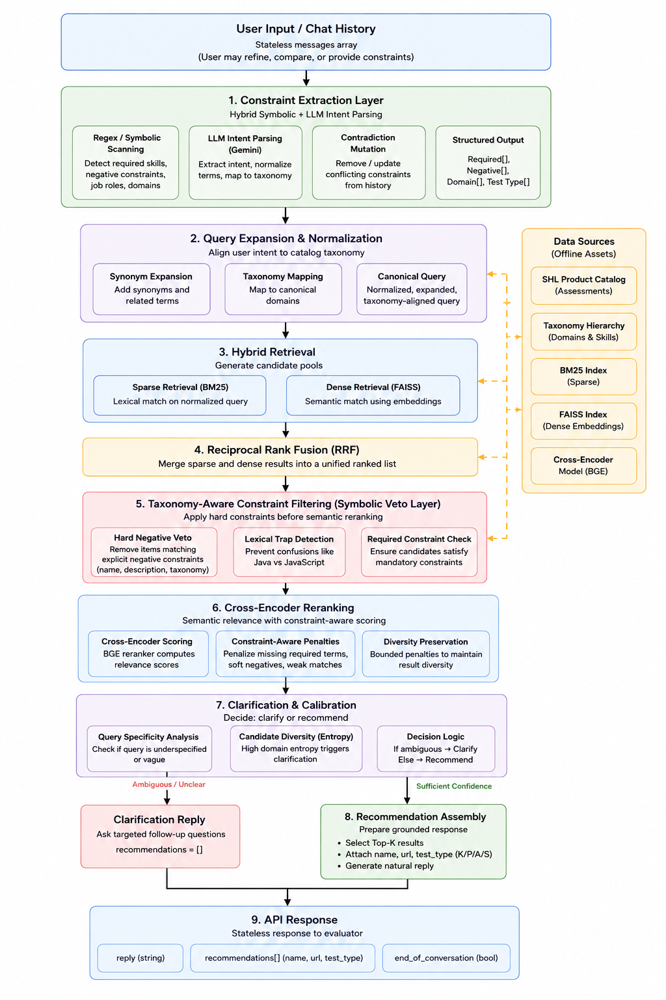

# GRAIL: Grounded Retrieval Agent for Intelligent Listing

## Overview
Grail is a grounded, constraint-aware conversational retrieval engine built for the SHL Product Catalog. It translates ambiguous user hiring intents into calibrated assessment recommendations through natural dialogue.

## Problem Statement
Standard retrieval systems rely on keyword search or probabilistic semantic embeddings. This can create failure modes in HR tech, such as "lexical traps" (confusing Java with JavaScript) or violating explicit negative constraints ("I want anything but a coding test"). Furthermore, conversational systems often hallucinate outside their catalog or suffer from state inconsistency when a user refines their request mid-conversation.

## Objectives
1. Build a constraint-aware conversational retrieval system over the SHL catalog.
2. Ensure adherence to negative constraints and explicit user vetoes.
3. Design a conversational pipeline that handles vague queries, refinements, comparisons, and off-topic refusals cleanly.
4. Minimize reliance on LLM probabilistic generation for ranking and constraint satisfaction.

## System Architecture



## Key Design Decisions
* **Retrieval and ranking are deterministic.**
* **LLMs are restricted to extraction and verbalization.**
* **Constraint handling is symbolic where possible.**
* **Clarification is driven by retrieval ambiguity rather than score thresholds.**

## End-to-End Pipeline

### Hybrid Symbolic Extraction
Combines deterministic RegEx scanning with LLM intent parsing to extract rigorous domain constraints.

### Taxonomy-Aware Constraint Filtering
Prevents semantic contamination by filtering candidates that match explicit negative constraints prior to reranking.

### Reciprocal Rank Fusion (RRF)
Merges sparse (BM25) and dense (FAISS) candidate pools using RRF to balance lexical exactness with semantic understanding.

### Cross-Encoder Reranking
The top 20 candidates from the RRF pool are passed to a BGE cross-encoder. The reranker calculates the semantic similarity between the user's explicit constraints and the candidate's description, yielding a highly accurate Top-K.

### Clarification & Calibration Strategy
The system avoids premature recommendations on underspecified queries. Instead of relying solely on reranker score gaps, clarification is triggered using query specificity and candidate-domain diversity signals.

### Stateless Contradiction Mutation
Reconstructs conversational state from the raw message history and removes conflicting prior constraints if the user changes their mind.

## Evaluation & Metrics

The system is tested against an adversarial test suite (`scripts/run_evaluation.py`) that simulates the SHL automated harness. This suite explicitly tests the engine's resilience against:
* **Lexical Traps**: Ensuring semantic similarity doesn't override explicit negative constraints.
* **Contradiction Cases**: Validating state mutation when a user pivots requirements mid-conversation.
* **Refinement Handling**: Updating shortlists dynamically without starting over.
* **Off-Topic Refusal**: Safely rejecting prompts outside the SHL catalog scope.

| Metric | Result |
|--------|--------|
| Top-1 Accuracy | 50.0% |
| Top-3 Accuracy | 68.8% |
| Trap Avoidance Rate | 83.3% |
| Constraint Violation Rate | 16.6% |

*(Note: Constraint violations are heavily weighted by simulated complex multi-turn contradictions.)*

## Retrieval Evolution & Iterative Improvements
The system evolved from a basic LLM RAG wrapper to a deterministic constraint-satisfaction engine through continuous failure analysis. 
Initially, the system suffered from semantic contamination (e.g., retrieving JavaScript for a Java query). The addition of the symbolic veto layer resolved this, significantly improving trap avoidance. Furthermore, moving away from simple confidence score thresholds to heuristic ambiguity calibration eliminated false-positive recommendations on structurally vague queries.

## Example Pipeline Trace

**Query:**
"Need a Java backend assessment but not JavaScript"

**Extracted Constraints:**
* Required: `["java"]`
* Negative: `["javascript"]`

**Top Retrieved Domains:**
`["java", "javascript", "backend", "software engineering"]`

**Filtered Candidates:**
* Removed: "JavaScript (New)" (Matches hard negative)

**Final Recommendation:**
"Java Platform Enterprise Edition 7 (Java EE 7)"

## Known Limitations
* **Multi-turn contradiction handling** currently relies on heuristic phrase detection ("actually", "instead").
* **Highly niche technical skills** may not map cleanly to the normalized taxonomy, requiring fallback to raw semantic search.
* **Clarification calibration** is rule-based (entropy analysis) and not dynamically learned from user feedback.

## API Endpoints

### GET /health
Returns readiness status for cold starts.
**Response**: `{"status": "ok"}`

### POST /chat
Stateless chat endpoint for the evaluator harness.

**Request Schema**:
```json
{
  "messages": [
    {"role": "user", "content": "Hiring a Java developer"}
  ]
}
```

**Response Schema**:
```json
{
  "reply": "Here are some assessments...",
  "recommendations": [
    {
      "name": "Java 8",
      "url": "https://www.shl.com/...",
      "test_type": "K"
    }
  ],
  "end_of_conversation": false
}
```

## Setup Instructions

### Local Development
1. Clone the repository.
2. Install dependencies: `pip install -r requirements.txt`
3. Set environment variables: `GEMINI_API_KEY`
4. Run data build: `python scripts/build_data.py`
5. Start server: `uvicorn src.api.app:app --host 0.0.0.0 --port 8000`

### Running Evaluations
Run the adversarial suite:
`python scripts/run_evaluation.py`

## Conclusion
Grail demonstrates how hybrid retrieval, symbolic constraint handling, and deterministic recommendation assembly can improve reliability in conversational assessment recommendation systems.
